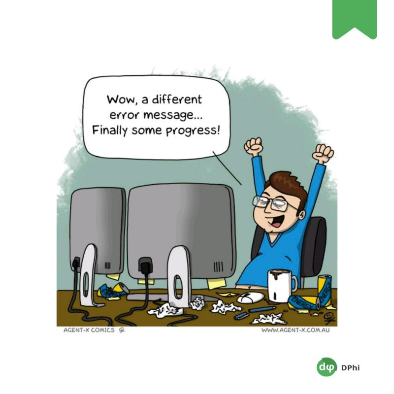

# Dphi-Bootcamps
An open education AI community - which is home to thousands of data scientists from 150+ countries. As part of community initiatives.

Dphi frequently conduct datathons, bootcamps on cutting-edge technologies such as Deep Learning, Machine Learning, etc, and host live sessions with industry experts.

The resources stored in this repository cover data visualization, Pandas & Python topics.



# Setup
**Clone** or **download** the repository as follows:
```
$ git clone https://github.com/RdEl00/Dphi_Bootcamps.git
$ cd Dphi_Bootcamps
```